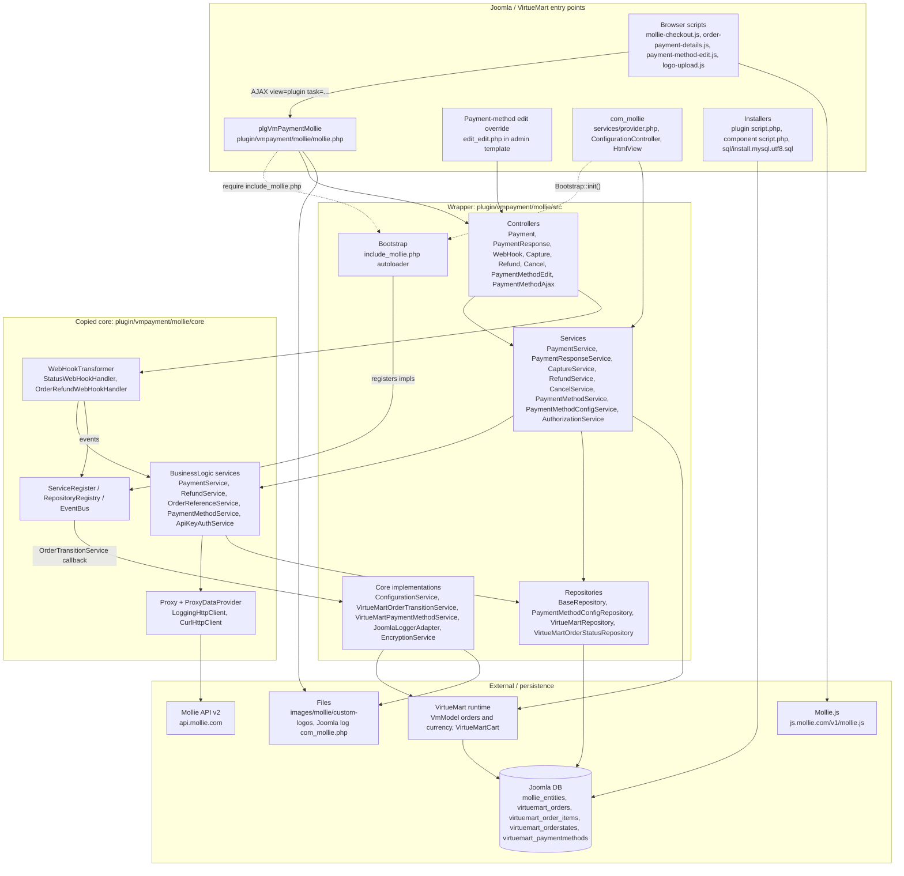
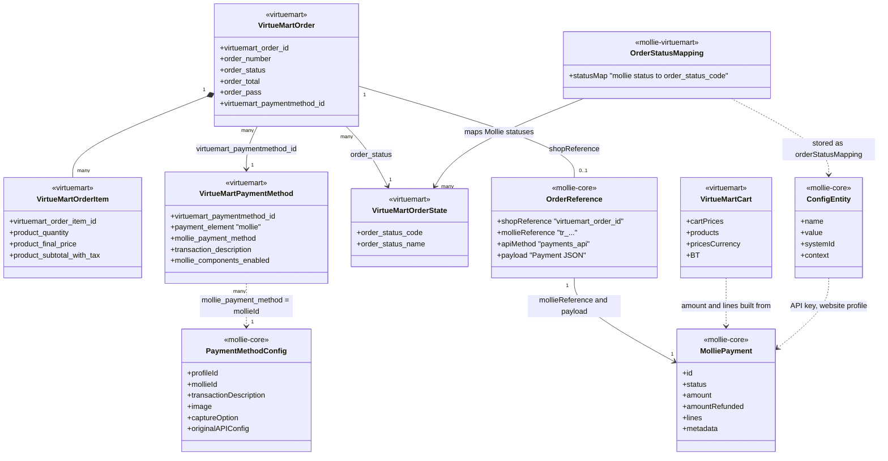
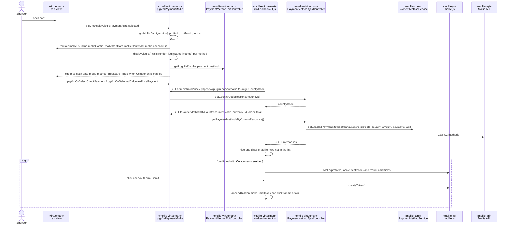
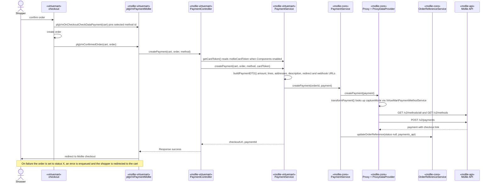
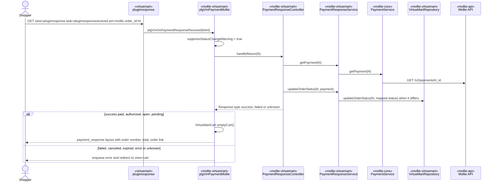
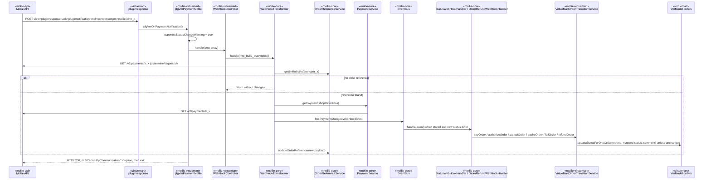
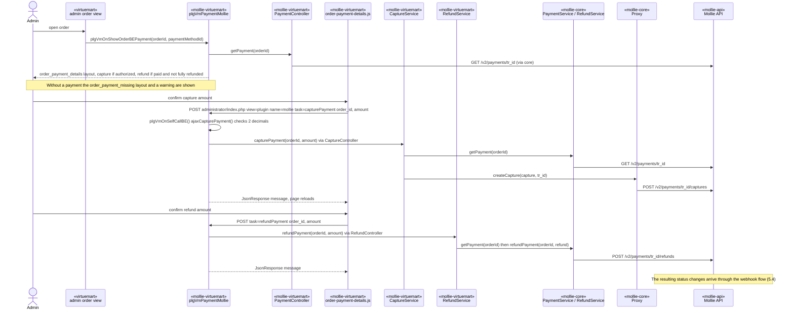
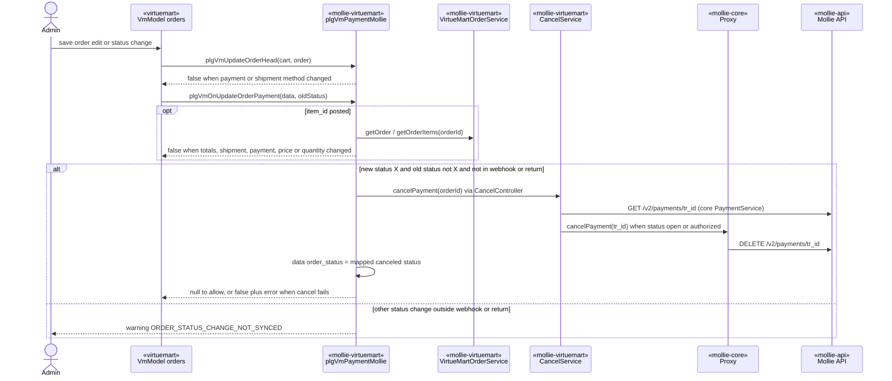
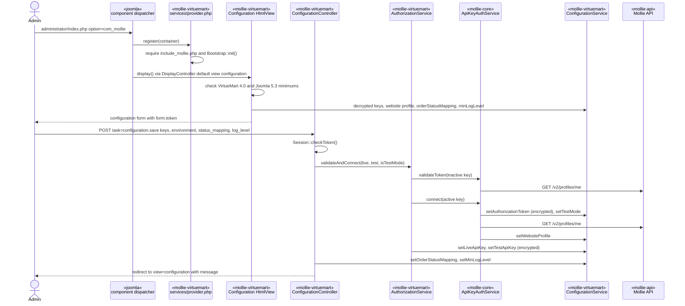
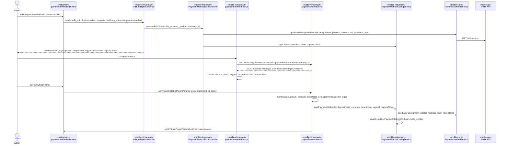

# DESIGN.md — Mollie payments for VirtueMart

Living architecture record. Describes the system **as it is** on branch `main` (Joomla 5.3, VirtueMart 4), the only maintained branch. Any architectural change updates this file, including its diagrams, in the same pass.

## 1. Purpose

This package lets a Joomla 5.3 / VirtueMart 4 shop take payments through Mollie. It ships two Joomla extensions in one package (`pkg_mollie.xml`):

- the VirtueMart payment plugin `plg_vmpayment_mollie` (`plugin/vmpayment/mollie/`)
- the admin component `com_mollie` (`administrator/components/com_mollie/`)

The shop admin creates one VirtueMart payment method per Mollie method. Every such method uses the payment element `mollie`, and the Mollie method id is picked in the payment-method edit form. `SupportedPaymentMethods::SUPPORTED` lists the 17 selectable ids.

The component connects the shop to Mollie with live/test API keys, maps Mollie payment statuses to VirtueMart order statuses, and sets the log level. The plugin covers the rest:

- storefront method listing with country filtering and Mollie Components for credit cards
- payment creation on order confirmation
- the redirect return and the webhook
- a Mollie block on the admin order page with capture and refund actions
- cancelling the Mollie payment when an admin cancels the order
- the Mollie fields in the VirtueMart payment-method edit form

Business logic lives in a copied `mollie/integration-core`: API proxy, payment/refund services, order references, webhook dispatch, ORM and configuration. This repository is the Joomla/VirtueMart wrapper. It implements the core's integration interfaces and maps VirtueMart carts and orders to Mollie DTOs.

## 2. Architecture overview

The design has four layers, and dependencies point downward:

1. **Joomla / VirtueMart entry points.** These are thin adapters invoked by Joomla or VirtueMart:
   - `plgVmPaymentMollie` (`mollie.php`, a `vmPSPlugin`), called through VirtueMart plugin triggers
   - the `com_mollie` admin component (Joomla MVC)
   - the VirtueMart payment-method edit template override (`edit_edit.php`)
   - browser scripts
   - the installer scripts
2. **Wrapper** (`Mollie\Payment\*` under `plugin/vmpayment/mollie/src/`). This layer holds `Bootstrap`, the controllers, the application services, the Joomla/VirtueMart implementations of core interfaces, and the repositories.
3. **Copied core** (`plugin/vmpayment/mollie/core/`, original namespaces `Mollie\BusinessLogic\*` and `Mollie\Infrastructure\*`; the base is integration-core 1.3.11). It provides `ServiceRegister`, `RepositoryRegistry`, `EventBus`, `Proxy`/`ProxyDataProvider`, `PaymentService`, `RefundService`, `OrderReferenceService`, `PaymentMethodService`, `ApiKeyAuthService`, `WebHookTransformer` and `Configuration`.
4. **External systems and persistence.** These are the Mollie API, Mollie.js, and the Joomla database (`#__mollie_entities` plus VirtueMart tables). File storage covers custom logos and the Joomla log file.

The core calls back into the wrapper only through registered interfaces and abstract classes:
- `Integration\Interfaces\OrderTransitionService` → `VirtueMartOrderTransitionService`
- `Infrastructure\Configuration\Configuration` / `BusinessLogic\Configuration` → `ConfigurationService`
- `Infrastructure\Logger\Interfaces\ShopLoggerAdapter` → `JoomlaLoggerAdapter`
- `ORM\Interfaces\RepositoryInterface` → `BaseRepository`, `PaymentMethodConfigRepository`
- `BusinessLogic\PaymentMethod\PaymentMethodService` → `VirtueMartPaymentMethodService` (subclass)
- `Authorization\Interfaces\EncryptionService` → `EncryptionService`
- `Http\ApiKey\ProxyDataProvider` is registered under the core `ProxyDataProvider::CLASS_NAME`, so it replaces the org-token data provider.

All Mollie HTTP goes through the core `Proxy`/`BaseProxy`, which wraps `CurlHttpClient` in `LoggingHttpClient`. The `mollie/mollie-api-php` SDK is not used.

## 3. Key components

| Component | Responsibility | Collaborators |
|---|---|---|
| `Bootstrap` (`src/Bootstrap.php`) | Composition root. It extends the core `BusinessLogic\BootstrapComponent` and guards `init()` with a static flag. `initServices()` registers `ConfigurationService`, `ApiKeyAuthService`, the wrapper `AuthorizationService`, `CurlHttpClient`, `ApiKey\ProxyDataProvider`, `JoomlaLoggerAdapter`, `VirtueMartPaymentMethodService` (as the core `PaymentMethodService`), `VirtueMartOrderTransitionService`, `EncryptionService`, the two VirtueMart repositories and all wrapper services. `initRepositories()` maps `ConfigEntity` and `OrderReference` to `BaseRepository`, and `PaymentMethodConfig` to `PaymentMethodConfigRepository`. | core `ServiceRegister`, `RepositoryRegistry`; called from `mollie.php` and `com_mollie/services/provider.php` |
| `plgVmPaymentMollie` (`mollie.php`) | The VirtueMart payment plugin (`vmPSPlugin`). It declares the plugin params `mollie_payment_method`, `transaction_description` and `mollie_components_enabled`. It implements the checkout triggers, `plgVmConfirmedOrder`, `plgVmOnPaymentResponseReceived`, `plgVmOnPaymentNotification`, the admin order triggers (`plgVmOnShowOrderBEPayment`, `plgVmOnUpdateOrderPayment`, `plgVmUpdateOrderHead`), backend AJAX routing (`plgVmOnSelfCallBE`) and the payment-method save hook (`plgVmSetOnTablePluginParamsPayment`, including logo upload). | wrapper controllers, `VmModel`, `VirtueMartCart`, Joomla `Factory`, `JsonResponse` |
| `PaymentController` + `PaymentService` (`src/Payment/`) | Builds the core `Payment` DTO from the cart and order. The fields are: amount from `cartPrices['billTotal']` in the cart currency, a description from the template placeholders (`DescriptionParameters`), redirect and webhook URLs, the locale, product/discount/shipping lines, `methods = [mollie_payment_method]`, metadata `order_id`/`order_number`, the card token, and billing/shipping addresses. It then calls core `PaymentService::createPayment` and returns the checkout URL. | core `PaymentService`, `VirtueMartRepositoryInterface`, `VmModel` currency |
| `PaymentResponseController` + `PaymentResponseService` | Handles the Mollie redirect. It fetches the payment by VirtueMart order id, writes the mapped VirtueMart status when it differs, and classifies the result: `paid`/`authorized`/`open`/`pending` count as success, and `failed`/`canceled`/`expired` count as failed. | core `PaymentService`, `ConfigurationService`, `VirtueMartRepository` |
| `WebHookController` (`src/WebHook/Controller/`) | Rebuilds the raw body from the POST array and hands it to the core `WebHookTransformer`. `HttpCommunicationException` becomes an error `Response`, which the plugin turns into HTTP 503. | core `WebHookTransformer` |
| `VirtueMartOrderTransitionService` (`src/Adapter/`) | Core `OrderTransitionService`. `payOrder` and `completeOrder` map to `paid`, then `authorizeOrder` → `authorized`, `cancelOrder` → `canceled`, `expireOrder` → `expired`, `failOrder` → `failed` and `refundOrder` → `refunded`. Each resolves the VirtueMart status through `getOrderStatusMapping()`. It skips an empty mapping or an unchanged status, then calls `VmModel('orders')->updateStatusForOneOrder()` with a comment. | `ConfigurationService`, VirtueMart orders model |
| `CaptureController` + `CaptureService` | Captures an `authorized` payment. The amount must be greater than 0 and at most the authorized amount. It calls core `Proxy::createCapture`. | core `PaymentService`, `OrderReferenceService`, `Proxy` |
| `RefundController` + `RefundService` (`src/Refund/`) | Refunds a `paid` payment up to paid minus `amountRefunded`, through core `RefundService::refundPayment`. | core `RefundService`, core `PaymentService` |
| `CancelController` + `CancelService` | Cancels an `open` or `authorized` Mollie payment through `Proxy::cancelPayment`. A missing order reference counts as success ("No payment to cancel"). | core `PaymentService`, `OrderReferenceService`, `Proxy` |
| `PaymentMethodService` (`src/PaymentMethod/`) | Returns the enabled Mollie methods for a profile and currency (sample amount 100), filtered by `SupportedPaymentMethods`. It also returns the enabled method ids for a country, total and currency, picks the selected method and its default logo (`SelectedMethodData`), and resolves currency and country codes. | core `PaymentMethodService`, `VirtueMartRepositoryInterface` |
| `VirtueMartPaymentMethodService` | Subclass of the core `PaymentMethodService`. It overrides `getPaymentConfigurationById()` to match on the Mollie id (it strips `mollie_`). The core `ProxyDataProvider::transformPayment` uses it to find `captureMode`. | core `PaymentMethodService`, `Proxy` |
| `PaymentMethodConfigService` (`src/Configuration/`) | Reads and writes the per-method `PaymentMethodConfig`: transaction description, custom logo (`image`) and `captureOption`. A new config is seeded from the enabled-methods API response. | `PaymentMethodConfigRepository`, core `PaymentMethodService`, `ConfigurationService` |
| `PaymentMethodEditController` / `PaymentMethodAjaxController` | Supply data for the payment-method edit form (methods, selection, logo, description, capture mode, `PaymentMethodCaptureRestrictions`) and the AJAX JSON responses (`getMethodsByCurrency`, `getCountryCode`, `getMethodsByCountry`). `PaymentMethodEditController::getLogoUrl()` also serves storefront and admin order logos. | `PaymentMethodService`, `PaymentMethodConfigService`, `PaymentMethodDisplayName` |
| `ConfigurationService` | Core `Configuration` implementation. It provides: integration name `VirtueMart` (version from `VmConfig::getInstalledVersion()`); extension name `MollieVirtueMart`, version `1.0.2`; `VERSION_CHECK_URL`; encrypted `liveApiKey`/`testApiKey`/`authToken`; `orderStatusMapping` with `OrderStatusMappingDefaults`; and `minLogLevel`. `isSystemSpecific()` returns `false`. | core `Configuration` (persists `ConfigEntity`), `EncryptionService` |
| `AuthorizationService` (`src/Authorization/`) | Validates the live/test key format (`ApiKey::isTest()`), validates the inactive key, connects the active key through `ApiKeyAuthService::connect()` (which stores the token, test mode and website profile) and stores both keys encrypted. | core `ApiKeyAuthService`, `ConfigurationService` |
| `EncryptionService` | libsodium `crypto_secretbox`. The key is `sha256(Joomla secret . 'mollie_encryption')`, and the output is base64 of the nonce followed by the ciphertext. | Joomla global config `secret` |
| `JoomlaLoggerAdapter` | Core `ShopLoggerAdapter`. It registers a Joomla text logger (`com_mollie.php`, category `com_mollie`), filters by `LoggerConfiguration::getMinLogLevel()`, and maps core levels 0–3 to `Log::ERROR`/`WARNING`/`INFO`/`DEBUG`. | Joomla `Log` |
| `BaseRepository` (`src/Repository/`) | Core `RepositoryInterface` over the generic table `#__mollie_entities` (`type`, JSON `data`, `index1..index10`). It builds queries with the Joomla query builder and `quote()`/`(int)`. `PaymentMethodConfigRepository` adds `findByProfileAndMollieId()`. | Joomla `DatabaseInterface`, core `IndexHelper`, `QueryFilter` |
| `VirtueMartRepository`, `VirtueMartOrderStatusRepository` | Read access to `#__virtuemart_countries`, `#__virtuemart_orders`, `#__virtuemart_order_items` and `#__virtuemart_orderstates`. They also read currency data and update order status through the VirtueMart models. | Joomla `DatabaseInterface`, `VmModel` |
| `VirtueMartOrderService`, `VirtueMartOrderStatusService` | Thin façades: order and order items for the order-edit guard, and translated order-state options for the configuration page. | the two VirtueMart repositories |
| `com_mollie` (`services/provider.php`, `ConfigurationController`, `DisplayController`, `View/Configuration/HtmlView`) | Joomla 5 MVC component. `provider.php` requires the plugin autoloader and calls `Bootstrap::init()`. `HtmlView` checks VirtueMart ≥ 4.0 and Joomla ≥ 5.3, then loads keys, profile, status mapping, log level and VirtueMart statuses. `ConfigurationController::save()` connects and stores the settings. | `ConfigurationService`, `AuthorizationService`, `VirtueMartOrderStatusService` |
| Installers (`plugin/vmpayment/mollie/script.php`, `com_mollie/script.php`, `sql/*.sql`) | The plugin postflight re-points `#__virtuemart_paymentmethods.payment_jplugin_id` for `payment_element = 'mollie'` to the current extension id. The component postflight inserts order state `AM` "Authorized (Mollie)" and copies `edit_edit.php` into the default admin template. Component SQL creates and drops `#__mollie_entities`. | Joomla `DatabaseInterface`, `File`/`Folder` |

## 4. Domain model

Every entity and participant in sections 4 and 5 is labelled with the system that owns it:

| Label | Owner |
|---|---|
| `«virtuemart»` | VirtueMart: tables, the `VmModel` order/currency models, `VirtueMartCart`, `vmPSPlugin`, cart and checkout pages, admin order and payment-method views |
| `«joomla»` | The Joomla CMS: application, MVC dispatcher, installer, database service, `Log`, global configuration |
| `«mollie-virtuemart»` | This repository's own code (`plugin/vmpayment/mollie/` outside `core/`, `administrator/components/com_mollie/`) |
| `«mollie-core»` | The copied core under `plugin/vmpayment/mollie/core/` (integration-core 1.3.11 base) |
| `«mollie-api»` | The external Mollie API (sequence diagrams only) |
| `«mollie-js»` | Mollie Components script `js.mollie.com/v1/mollie.js` (sequence diagrams only) |

Class diagrams put the label inside the class as an annotation (`<<virtuemart>>`). In sequence diagrams the label is the first line of the participant alias, followed by ` ` and the name, with no quotes: `participant VM as «virtuemart» vmPSPlugin`. New diagrams, including those in plans, follow the same convention.

`OrderStatusMapping` and the non-persisted `Response` belong to this repository. `OrderStatusMapping` is stored as the `ConfigEntity` value `orderStatusMapping`. The `«mollie-core»` entities are defined by the core and persisted by this repository's `BaseRepository` into `#__mollie_entities`. `MolliePayment` is the core DTO (`Http\DTO\Payment`) of the Mollie payment resource. `«virtuemart»` records are read through `VirtueMartRepository` or the VirtueMart models, and written through the VirtueMart models.

Persistence summary:
- `#__mollie_entities` holds `ConfigEntity`, `OrderReference` and `PaymentMethodConfig`. Rows are discriminated by `type` and carry up to 10 string indexes. `ConfigEntity` names used here are `authToken`, `liveApiKey` and `testApiKey` (encrypted), plus `testMode`, `websiteProfile`, `orderStatusMapping` and `minLogLevel`.
- VirtueMart stores the plugin params (`mollie_payment_method`, `transaction_description`, `mollie_components_enabled`) with the payment method through `setConfigParameterable()`/`setOnTablePluginParams()`.
- The plugin declares its own VirtueMart payment table through `getVmPluginCreateTableSQL()`/`getTableSQLFields()`.
- VirtueMart tables that are written: order status (orders model), order state `AM` (component installer), and `payment_jplugin_id` (plugin installer).

## 5. Key flows

The repository has no payment-link flow, no stock-reset flow and no version-check flow.

### 5.1 Checkout: method list and card token

### 5.2 Payment creation on order confirmation

### 5.3 Redirect return

### 5.4 Webhook status update

### 5.5 Admin order detail: capture and refund

### 5.6 Admin order cancel and order-edit guard

### 5.7 Connect and configuration (admin component)

### 5.8 Payment-method edit (template override, AJAX and save)

## 6. Module map

| Path | Responsibility | Key entry points |
|---|---|---|
| `pkg_mollie.xml` | Joomla package manifest (component + plugin, version 1.0.2, update server `https://www.mollie.com/updates/virtuemart/extension.xml`) | — |
| `build.sh` | Builds `com_mollie.zip` (`admin/` + `media/`), `plg_vmpayment_mollie.zip` and `pkg_mollie_1.0.2.zip` | `./build.sh` |
| `plugin/vmpayment/mollie/mollie.php` | VirtueMart payment plugin `plgVmPaymentMollie`. Requires the autoloader and calls `Bootstrap::init()` at file load. | `plgVmDisplayListFEPayment`, `plgVmOnCheckoutCheckDataPayment`, `plgVmConfirmedOrder`, `plgVmOnPaymentResponseReceived`, `plgVmOnPaymentNotification`, `plgVmOnShowOrderBEPayment`, `plgVmOnUpdateOrderPayment`, `plgVmUpdateOrderHead`, `plgVmOnSelfCallBE`, `plgVmSetOnTablePluginParamsPayment` |
| `plugin/vmpayment/mollie/include_mollie.php` | `spl_autoload_register`: `Mollie\BusinessLogic\` and `Mollie\Infrastructure\` → `core/`, `Mollie\Payment\` → `src/`, `Mollie\Component\` → `com_mollie/src/` | required by `mollie.php` and `provider.php` |
| `plugin/vmpayment/mollie/mollie.xml`, `script.php` | Plugin manifest (vmconfig field `configmessage`, hidden `checkConditionsCore`) and installer | `plgVmPaymentMollieInstallerScript::postflight()` |
| `plugin/vmpayment/mollie/src/` | Wrapper code (`Mollie\Payment\*`) | `Bootstrap.php`, `Adapter/`, `Authorization/`, `Cancel/`, `Capture/`, `Configuration/`, `Infrastructure/DTO/`, `Interface/`, `Payment/`, `PaymentMethod/`, `Refund/`, `Repository/`, `WebHook/` |
| `plugin/vmpayment/mollie/core/` | Copied core (integration-core 1.3.11 base), original namespaces | `BusinessLogic/BootstrapComponent.php`, `Http/Proxy.php`, `WebHook/WebHookTransformer.php`, `Infrastructure/ServiceRegister.php` |
| `plugin/vmpayment/mollie/tmpl/` | Plugin layouts | `creditcard_fields.php`, `payment_response.php`, `order_payment_details.php`, `order_payment_missing.php` |
| `plugin/vmpayment/mollie/assets/` | Storefront and admin-order JS/CSS | `js/mollie-checkout.js`, `js/order-payment-details.js`, `css/*.css` |
| `plugin/vmpayment/mollie/fields/configmessage.php` | `JFormFieldConfigmessage`: link from the plugin params to `com_mollie` | — |
| `plugin/vmpayment/mollie/language/en-GB/` | Plugin strings `PLG_VMPAYMENT_MOLLIE_*` | `en-GB.plg_vmpayment_mollie.ini` |
| `administrator/components/com_mollie/services/provider.php` | DI provider: bootstrap plus `MVCFactory`/`ComponentDispatcherFactory` for `Mollie\Component\Mollie` | `register()` |
| `administrator/components/com_mollie/src/` | Admin controllers and view | `Controller/ConfigurationController`, `Controller/DisplayController`, `View/Configuration/HtmlView` |
| `administrator/components/com_mollie/tmpl/configuration/default.php` | Configuration form (keys, environment, status mapping, log level) | — |
| `administrator/components/com_mollie/sql/` | Create/drop `#__mollie_entities` | `install.mysql.utf8.sql`, `uninstall.mysql.utf8.sql` |
| `administrator/components/com_mollie/script.php` | Order state `AM`, install/remove the `edit_edit.php` override | `Com_MollieInstallerScript::postflight()`, `uninstall()` |
| `administrator/components/com_mollie/assets/` | Payment-method edit override, its JS, banner image | `overrides/edit_edit.php`, `js/payment-method-edit.js`, `js/logo-upload.js` |
| `administrator/components/com_mollie/language/en-GB/` | Component strings `COM_MOLLIE_*` | `en-GB.com_mollie.ini` |
| `media/com_mollie/css/` | Configuration page stylesheet (Web Asset Manager) | `configuration.css` |

## 7. Key patterns & conventions

- **Composition root and service locator: the preferred way to resolve dependencies.**
  - `Bootstrap::init()` runs in two places. `mollie.php` calls it when Joomla loads the plugin file. `com_mollie/services/provider.php` calls it when the component boots, after requiring `include_mollie.php`. The payment-method edit override uses wrapper classes and relies on the plugin being loaded.
  - `Bootstrap` registers every wrapper implementation and service in the core `ServiceRegister` and maps entities to repositories via `RepositoryRegistry`.
  - Preferred pattern: register new services in `Bootstrap::initServices()` and resolve them with `ServiceRegister::getService(X::CLASS_NAME)`, or `X::class` for wrapper classes that have no `CLASS_NAME`. Constructors take dependencies as `private readonly` promoted properties.
  - Controllers are created with `new` in `mollie.php` and the override, and resolve their services from `ServiceRegister` in their constructors.
  - Existing deviations: `ConfigurationService::getInstance()` in `ConfigurationController` and `HtmlView`; direct `VmModel::getModel()` calls in `mollie.php`, `PaymentService`, `VirtueMartOrderTransitionService` and `VirtueMartRepository`; `RepositoryRegistry::getRepository()` in `PaymentMethodConfigService`; core singletons (`ApiKeyAuthService`, `ConfigurationService`, `VirtueMartPaymentMethodService`) created through `getInstance()` inside the registrations.
- **Core boundary interfaces.** The core reaches the shop only through the implementations listed in §2. Status changes reach VirtueMart only through `VirtueMartOrderTransitionService`, which the core webhook handlers call via `EventBus`. The wrapper fires no `Integration*Event`. Admin actions call wrapper services, and those services call core services or `Proxy` directly.
- **Request routing.** Every HTTP entry is a Joomla or VirtueMart route. There are no custom front controllers.
  - Storefront and checkout: VirtueMart plugin triggers.
  - Return: `index.php?option=com_virtuemart&view=pluginresponse&task=pluginresponsereceived&pm=mollie&order_id=N`.
  - Webhook: `…&task=pluginnotification&tmpl=component&pm=mollie`. Both URLs are built with `Route::_(…, false, true, -1)`.
  - AJAX: `administrator/index.php?option=com_virtuemart&view=plugin&vmtype=vmpayment&name=mollie&task=<task>` → `plgVmOnSelfCallBE`, which dispatches with a `match` on `task` (`getMethodsByCurrency`, `getCountryCode`, `getMethodsByCountry`, `capturePayment`, `refundPayment`) and replies with `JsonResponse` + `$app->close()`.
  - Admin component: Joomla MVC (`view=configuration`, tasks `configuration.save` / `configuration.cancel`).
- **Persistence: the preferred way is the Joomla database service and query builder.** Repositories obtain `Factory::getContainer()->get(DatabaseInterface::class)`, build queries with `createQuery()`, and quote values with `quoteName()`/`quote()` or cast them with `(int)`. Entity writes use `insertObject`/`updateObject`.
  - Core entities go into one generic table, `#__mollie_entities` (`type`, JSON `data`, `index1..index10`), created and dropped by the component SQL files. There are no schema migrations.
  - VirtueMart order status changes go through `VmModel('orders')->updateStatusForOneOrder()`, never through direct SQL, so VirtueMart's own triggers and notifications run.
  - Installers use the query builder for `#__extensions`, `#__virtuemart_paymentmethods`, `#__virtuemart_orderstates` and `#__template_styles`.
  - Settings live in `ConfigEntity` rows, not in Joomla component params. Per-method settings are the VirtueMart plugin params plus `PaymentMethodConfig`.
- **Response DTO between controllers and entry points.** Wrapper controllers return `Infrastructure\DTO\Response` (`type`, `data`, `error`) and catch exceptions themselves. `mollie.php` turns responses into redirects, enqueued messages, rendered layouts or JSON.
- **Naming.**
  - Wrapper classes are `Mollie\Payment\<Area>\<Name>` with `Controller/` and `Mapping/` sub-namespaces. VirtueMart-facing adapters carry a `VirtueMart` or `Joomla` prefix.
  - The VirtueMart plugin class is `plgVmPaymentMollie`. The payment element is `mollie`.
  - Mollie status keys are `open|canceled|pending|authorized|expired|failed|paid|refunded` (`MollieStatusMapping`). The default mapping is `OrderStatusMappingDefaults`: `canceled`/`expired` → `X`, `pending` → `P`, `authorized` → `AM`, `failed` → `D`, `paid` → `C`, `refunded` → `R`, `open` → none.
  - Language keys are `PLG_VMPAYMENT_MOLLIE_*` and `COM_MOLLIE_*`.
- **Status-change echo suppression.** `plgVmOnPaymentNotification` and `plgVmOnPaymentResponseReceived` set `suppressStatusChangeWarning`. Status writes made during a webhook or return then skip the cancel-at-Mollie path and the "not synced" warning in `plgVmOnUpdateOrderPayment`.
- **Request data instead of session.** The wrapper does not use the Joomla session. The card token travels as the POST field `mollieCardToken`. The order id travels in the redirect URL. Checkout data comes from `VirtueMartCart`.
- **Error surfacing.**
  - Admin and shopper messages go through `Factory::getApplication()->enqueueMessage()`.
  - AJAX errors are returned as `JsonResponse` with an `error` field.
  - The core `NotificationHub` is not wired to a wrapper UI.
- **Logging.** `Logger::logX()` (core) writes through `JoomlaLoggerAdapter` to the Joomla log file `com_mollie.php`. The configuration page sets the level: `disabled` (-1, the default), `errors` (`Logger::ERROR`) or `everything` (`Logger::DEBUG`).
- **API-key encryption.** `ConfigurationService` encrypts `liveApiKey`, `testApiKey` and `authToken` with `EncryptionService` before `saveConfigValue()` and decrypts them on read. A decrypt failure is logged and returns `null`.
- **API selection.** Only the Payments API is used (`PaymentMethodConfig::API_METHOD_PAYMENT`). Capture mode per method is `automatic` or `manual` (`captureOption`). The methods in `PaymentMethodCaptureRestrictions::AUTOMATIC_ONLY` hide the selector.

## 8. External boundaries

| Boundary | Direction | Details |
|---|---|---|
| Mollie API v2 (`https://api.mollie.com/v2/`; reference: https://docs.mollie.com/reference/overview) | outbound | Calls go through core `Proxy` + `LoggingHttpClient(CurlHttpClient)` with the bearer token from `ConfigEntity authToken`. The calls are: `GET methods` (country filter AJAX, currency AJAX, edit form, new `PaymentMethodConfig`); `GET methods/all` + `GET methods` plus `POST payments` on every payment creation (captureMode lookup in `transformPayment`); `GET payments/{id}` (return, admin order view, capture/refund/cancel pre-checks, webhook ×2); `DELETE payments/{id}`; `POST payments/{id}/captures`; `POST payments/{id}/refunds`; `GET profiles/me` on connect. |
| Mollie webhook → `index.php?option=com_virtuemart&view=pluginresponse&task=pluginnotification&tmpl=component&pm=mollie` | inbound | Form POST with `id`. There is no signature. Authenticity comes from fetching the payment back from the API by id. The response is 200 on success or unknown reference, 503 when the controller returns an error (`HttpCommunicationException`), then `exit`. |
| Mollie hosted checkout → `…&task=pluginresponsereceived&pm=mollie&order_id=N` | inbound (browser) | `redirectUrl` in the payment. Fetches the payment, writes the mapped status, renders the result or redirects to the cart. |
| Mollie Components (`https://js.mollie.com/v1/mollie.js`) | browser | Registered by `plgVmDisplayListFEPayment`. Card tokenisation with `profileId`, `locale`, `testmode` from `window.mollieConfig`. |
| Mollie dashboard (`https://www.mollie.com/dashboard/payments/<tr_id>`, `https://my.mollie.com/dashboard/developers/api-keys`) | browser links | "View in Mollie" in the admin order block. API-key link on the configuration page. |
| Version metadata (`ConfigurationService::VERSION_CHECK_URL` = `https://raw.githubusercontent.com/mollie/virtuemart/master/composer.json`, `PLUGIN_DOWNLOAD_URL` = `https://github.com/mollie/virtuemart/releases`) | outbound (declared) | Returned by `getExtensionVersionCheckUrl()` / `getExtensionDownloadUrl()`. The wrapper has no version-check flow. |
| Joomla update server (`https://www.mollie.com/updates/virtuemart/extension.xml`) | outbound (Joomla) | Declared in `pkg_mollie.xml`. |
| VirtueMart / Joomla runtime | in-process | VirtueMart: `vmPSPlugin` base methods, `VmModel::getModel('orders'\|'currency')`, `VirtueMartCart::getCart()`, `vmJsApi`, `vmText`, `VmHTML`, `ShopFunctions`. Joomla: `Factory::getApplication()`, `DatabaseInterface`, `WebAssetManager`, `Route`, `Uri`, `JsonResponse`, `Session::checkToken()`, `Log`, `InstallerScript`, `MVCFactory`, global config `secret`/`sitename`, filesystem (`images/mollie/custom-logos`, admin template override folder). |

## 9. Known constraints

- **PHP floor 8.1.** `Com_MollieInstallerScript::$minimumPhp = '8.1'`. Wrapper code uses 8.1 features: `readonly` promoted properties, `match`, the nullsafe operator, named arguments and union return types. The `sodium` extension is required by `EncryptionService`.
- **Joomla / VirtueMart range.** The supported platform is Joomla 5.3 with VirtueMart 4 (README, integration documentation). The configuration page shows its form only when `HtmlView::MINIMUM_JOOMLA_VERSION` (5.3) and `HtmlView::MINIMUM_VM_VERSION` (4.0) are met.
- **Core as a manual copy.** The core is included as a manual copy of `mollie/integration-core` under `plugin/vmpayment/mollie/core/`. It keeps the original `Mollie\BusinessLogic` / `Mollie\Infrastructure` namespaces and is loaded by `include_mollie.php`, not Composer. Its base is integration-core 1.3.11. **The copy is never edited in place.** A core change is made in `mollie/integration-core`, released there, and then re-copied into `plugin/vmpayment/mollie/core/` in full. Wrapper-specific contracts live in `src/`, not in the copy.
- **Single store.** `ConfigurationService::isSystemSpecific()` returns `false`, so all configuration is global. `getCurrentSystemId()` returns `md5(sitename . secret)`. There is no per-vendor or per-site scoping.
- **Branches.** `main` is the only maintained branch.
- **Manual verification.** There is no `composer.json`, no automated test suite and no CI. Changes are verified on a Joomla 5.3 + VirtueMart 4 install: build, install the package, then exercise checkout, return, webhook, and the admin order and configuration pages.
- **Packaging and version.** `build.sh` produces `pkg_mollie_<VERSION>.zip`. The version is kept in lockstep in five places: `build.sh` `VERSION`, `pkg_mollie.xml`, `plugin/vmpayment/mollie/mollie.xml`, `administrator/components/com_mollie/mollie.xml` and `ConfigurationService::VERSION`.
